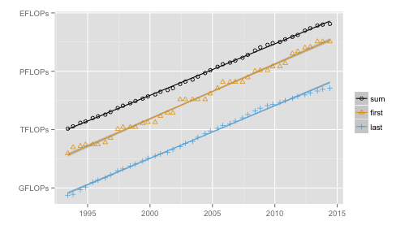

---

title       : How would your computer rank among the fastest computers in the world?
subtitle    : 
author      : 
job         : 
framework   : io2012        # {io2012, html5slides, shower, dzslides, ...}
highlighter : highlight.js  # {highlight.js, prettify, highlight}
hitheme     : tomorrow      # 
widgets     : [mathjax]            # {mathjax, quiz, bootstrap}
mode        : selfcontained # {standalone, draft}
knit        : slidify::knit2slides

--- &twocol w1:50% w2:50%


<style>

code {
  font-size: 70%;
  font-family: "Source Code Pro", monospace;
  color: darkred;
  text-align: left;
}

a {
color : #aa0000;
border-bottom:thin solid #aa0000;
}
h1,h2,h3,h4 {
  font-family: 'Open Sans','Helvetica', 'Crimson Text', 'Garamond',  'Palatino', sans-serif;

color: #aa0000;
}
.title-slide {
  background-color: #aa0000; /* #EDE0CF; ; #CA9F9D*/
  color: white;
}

.title-slide hgroup > h1, 
.title-slide hgroup > h2 {
  color: white ;  /* ; #EF5150*/
}

table {
  border: none;
  width: 100%;
  border-collapse: collapse;
  font-size: 22px;
  line-height: 26px;
  font-family: 'Open Sans','Helvetica', 'Crimson Text', 'Garamond',  'Palatino', sans-serif;
  font-weight: bolder;
}
table thead {
  border-top: 1px solid #aa0000;
  border-bottom: 1px solid #aa0000;
}
table th, table td, table caption {
  margin: 0;
  padding: 2pt 6pt;
  text-align: left;
  vertical-align: top;
}
table th {
  background: #FFCCCC;
  color: #444;
  text-transform: none;

}
table td {
  border-top: 1px solid #aa0000;

  border-bottom: 1px solid #aa0000;
}
table tr:nth-child(2n+1) {
  background: #FFE6E6;
}

slide:not(.segue) h2{
    font-family: 'Open Sans','Helvetica', 'Crimson Text', 'Garamond',  'Palatino', sans-serif;
  font-size: 52px;
  font-style: normal;
  font-weight: bold;
  text-transform: normal;
  letter-spacing: -2px;
  line-height: 1.2em;
  color: #aa0000;
}
</style>


## Computational power since 1993

<br>

*** =left

The Top500 list ranks the 500 most powerful computers in the world and has been released twice a year, since 1993.

This list allows us to keep track of computer evolution, for instance, computing power.


```r
flops <- read.table("flops.txt")
fitsum <- lm(log(sum, base = 2) ~ adate, data = flops)
ratesum <- fitsum$coefficients[2]
2^ratesum
```

```
## adate 
##  1.84
```


The computing power is multiplied by approximately 1.8 every year.

Then, your computer could be as powerful as a supercomputer of the nineties!


*** =right


Computational power of the fastest machine and the 500th at every ranking, as well as the sum of the power of all 500 machines in the list.

 


The $y$ scale is *logarithmic* and the units are:

| GFLOPs        | TFLOPs          |      PFLOPs     | EFLOPs |
|:-------------:|:---------------:|:---------------:|:-------:|
| $10^9$ FLOPs  | $10^{12}$ FLOPs | $10^{15}$ FLOPs |$10^{18}$ FLOPs |


---

## Computing power: definitions

Computing power is measured in *FLOPs* (Floating Point Operations Per Second).
The *theoretical* (or peak) computing power $R_{peak}$ can be computed as follows:

<center>
$R_{peak}$ = Number of cores $\times$ Frequency $\times$ Operations per clock cycle
</center>

The *measured* comuting power $R_{max}$ is the computing power as measured by a specific benchmark application, the *High Performance Linpack*.

The *efficiency* is defined as $R_{max}/R_{peak}$. For desktop and laptop computers with standard Intel processors, this value is between 80 and 95%.

### A quick comparison

<table>
<tr>
<td>
429th fastest machine<br>
in June 1994<br>
20 MHz<br>
512 cores<br>
$R_{max}$ : 1.0 GFLOPs
</td>
<td>
MacBook Air from 2010<br>
Frequency: 1.4 GHz<br>
2 cores<br>
Efficiency: 90%<br>
$R_{max}$ : 10.08 GFLOPs
</td>
<td>
fastest machine<br>
today<br>
GPUs<br>
3'120'000 cores<br>
$R_{max}$ : 33'862'700 GFLOPs
</td>
</tr>
</table>

<center>
<a href="https://rezzonic.shinyapps.io/PeerAsst/">Now you play</a>
</center>

---  &twocol w1:40% w2:60%

## Other facts about supercomputers

*** =left

<center>
#### Machines by operating systems
</center>

 


Historically, high performance computing was dominated by proprietary UNIX operating systems. Today, 96% of the 500 most powerful computers in the world run Linux. 


*** =right

<center>
#### Fastest computers, today
</center>

| Rank | Country     | RMax [PFLOPs] | Electricity [MW] | Accelerator |
| -----:| ----------- | -------------:| ---------:|:---------:|
|  1 | China       | 33.9 | 17.8 | Phi |
|  2 | USA         | 17.6 | 8.2 | NVIDIA |
|  3 | USA         | 17.2 | 7.9 | -- |
|  4 | Japan       | 10.5 | 12.7 | -- |
|  5 | USA         | 8.6  | 3.9 | -- |
|  6 | Switzerland | 6.3  | 2.3 | NVIDIA |
|  7 | USA         | 5.2  | 3.5 | Phi |
|  8 | Germany     | 5.0  | 2.3 | -- |
|  9 | USA         | 4.3  | 2.0 | -- |
| 10 | USA        | 3.1  | N/A | -- |

With great computing power comes great electricity consumption. For comparison, a town of 5'000 inhabitants uses approximately 5 MW.


---

## References

* The Top500 list: http://www.top500.org
* HPL benchmark: http://www.netlib.org/benchmark/hpl/

## For more information

* <a href="https://www.coursera.org/course/scicomp">Coursera class on High Performance Scientific Computing</a>
* If you want to run HPL: <a href="http://hpl-calculator.sourceforge.net">HPL Calculator</a>

## Wikipedia entries

* <a href="http://en.wikipedia.org/wiki/TOP500">Top500</a>
* <a href="http://en.wikipedia.org/wiki/FLOPS">FLOPs</a>
* <a href="http://en.wikipedia.org/wiki/Supercomputer">Supercomputer</a>

